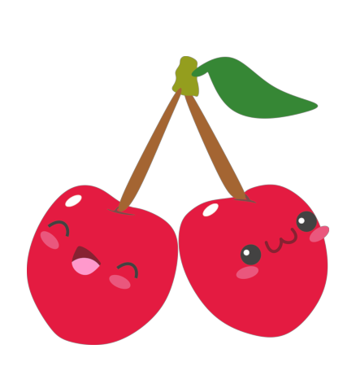
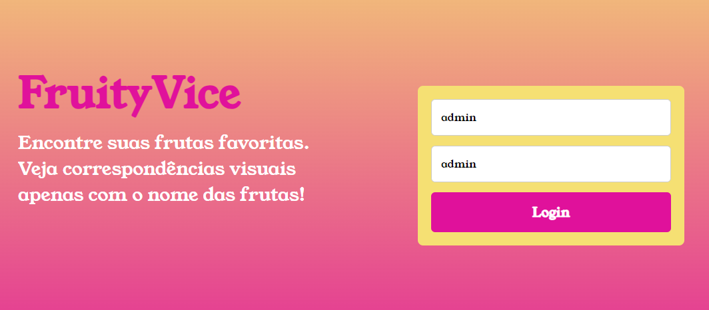

<<<<<<< HEAD
 # 

 Venha conhecer FruitVyce! 

 As frutas nos ajudam de diversas formas. Elas são fontes de hidratação, além de possuírem diversos minerais e vitaminas que são muito importantes para o nosso organismo. Pesquise e veja algumas imagens da fruta escolhida! 

### 🍒 TEMAS
- [Como funciona o FruitVyce?](#como-funciona?)
- [Funções do FruitVyce](#funcões)
- [Descrição do projeto FruitVyce](#descrição-do-projeto)
- [Ferramentas Utilizadas](#ferramentas-utilizadasAPI)

## 🍒 Como funciona o FruitVyce?

O FruitVyce funciona como uma espécie de galeria de frutas pesquisadas! O site fornece uma senha padrão para os usuários, que ao inserirem, conseguem acessar imagens referente as frutas que são procuradas.

## 🍒 Funcões do FruitVyce

• Permitir que o usuário acesse através de uma senha padrão 💻 

• Fornecer imagens das frutas pesquisadas 🔎

## 🍒 Descrição do projeto FruitVyce

 Projeto desenvolvido no Curso de Desenvolvimento de Sistemas, orientado pelo professor Fernando Leonid pela matéria de Programação Web Front-End na Instituição Senai Prof° Vicente Amato - Jandira, SP 📍. O projeto pode ser acessado em GitHub Pages: 
 
<a> https://carolneponucenaa.github.io/fruityVice2/</a>

## 🍒 Ferramentas Utilizadas

<strong>CSS, HTML, JS</strong> 

=======

# fruityVice2
>>>>>>> c78c70ca2cc332367ffff1542124e25c10efa9b0
